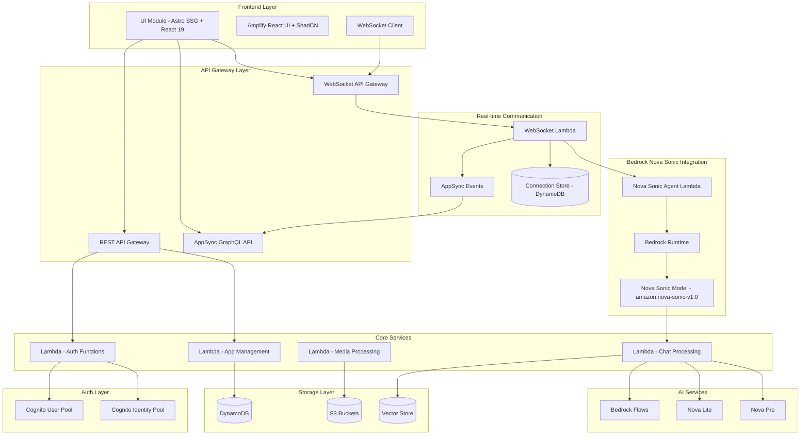
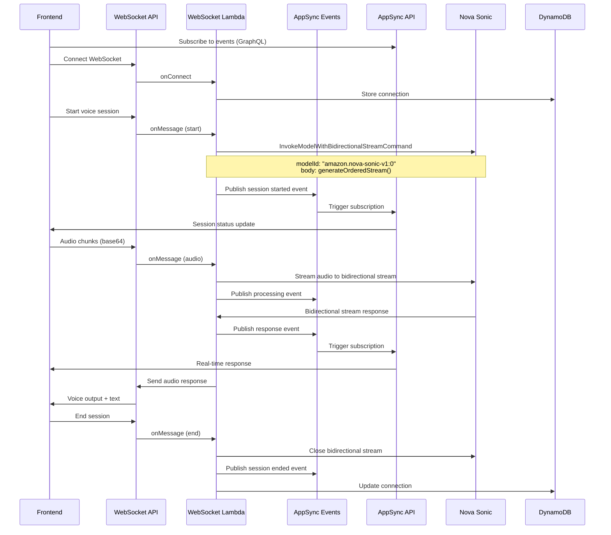
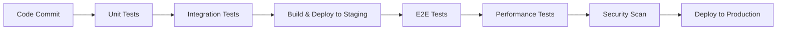

# Design Document

## Overview

AIrium is designed as a serverless, AI-powered groupware platform built on AWS infrastructure. The system follows a modular monorepo architecture with clear separation between backend infrastructure (Core Module) and frontend presentation (UI Module). The design emphasizes zero-cost-when-idle operation, user data isolation, and dynamic AI-driven user interfaces.

## Architecture

### High-Level Architecture

Based on the aws-samples/sample-serverless-nova-sonic-chat pattern:



### Monorepo Structure

Following the Nova Sonic chat sample pattern with Amplify Gen 2 integration:

```
airium/
├── packages/
│   ├── core/                    # Core Module (Amplify Gen 2)
│   │   ├── amplify/
│   │   │   ├── auth/
│   │   │   ├── data/
│   │   │   └── backend.ts
│   │   ├── lib/
│   │   │   ├── cdk-stacks/
│   │   │   │   ├── websocket-stack.ts
│   │   │   │   ├── nova-sonic-stack.ts
│   │   │   │   └── appsync-events-stack.ts
│   │   │   └── lambda-functions/
│   │   │       ├── websocket-handler/
│   │   │       ├── bedrock-nova-sonic-agent/
│   │   │       ├── connection-manager/
│   │   │       └── appsync-event-publisher/
│   │   └── amplify_outputs.json
│   └── ui/                      # UI Module (Astro + React)
│       ├── src/
│       │   ├── components/
│       │   │   ├── voice/
│       │   │   │   ├── VoiceChat.tsx
│       │   │   │   └── AudioStreamer.tsx
│       │   │   ├── websocket/
│       │   │   ├── appsync/
│       │   │   │   └── EventSubscriptions.tsx
│       │   │   └── chat/
│       │   ├── pages/
│       │   ├── layouts/
│       │   └── utils/
│       │       ├── websocket-client.ts
│       │       └── appsync-client.ts
│       └── astro.config.mjs
├── shared/
│   ├── types/
│   │   ├── websocket-events.ts
│   │   ├── nova-sonic-types.ts
│   │   └── appsync-events.ts
│   └── utils/
└── package.json
```

## Nova Sonic Integration Architecture

Following the aws-samples/sample-serverless-nova-sonic-chat pattern, the voice interaction system uses:

### WebSocket API Gateway
- Manages real-time bidirectional communication
- Handles connection lifecycle (connect, disconnect, message)
- Routes voice data to appropriate Lambda functions

### AppSync Events Integration
- Provides real-time GraphQL subscriptions for UI updates
- Handles event-driven communication between services
- Manages real-time notifications and status updates
- Integrates with Nova Sonic processing events

### Bedrock Nova Sonic Bidirectional Streaming
- Uses InvokeModelWithBidirectionalStreamCommand for real-time speech-to-speech
- Processes audio streams through Bedrock Runtime with amazon.nova-sonic-v1:0 model
- Handles bidirectional streaming for continuous conversation
- Manages ordered stream generation and response processing

#### Implementation Details
```typescript
// Core Bedrock Nova Sonic Implementation
const bedrockClient = new BedrockRuntimeClient({ region: 'us-east-1' });

const request = new InvokeModelWithBidirectionalStreamCommand({
  modelId: "amazon.nova-sonic-v1:0",
  body: generateOrderedStream(), // initial request
});

// Bidirectional stream handling
const response = await bedrockClient.send(request);
const stream = response.body;

// Process incoming audio and generate responses
for await (const chunk of stream) {
  // Handle streaming audio responses
  await processStreamChunk(chunk, connectionId);
}
```

### Connection Management
- DynamoDB table stores active WebSocket connections
- Maps users to connection IDs for targeted messaging
- Handles connection cleanup and session management

### Voice Processing Flow


## Components and Interfaces

### Core Module Components

#### 1. Authentication Service
- **Technology**: Amplify Gen 2 defineAuth + Cognito
- **Responsibilities**:
  - User registration and login
  - Group management
  - Identity pool management
  - JWT token validation
- **Key Interfaces**:
  ```typescript
  interface AuthService {
    createUser(userData: UserData): Promise<User>
    deleteUser(userId: string): Promise<void>
    createGroup(groupData: GroupData): Promise<Group>
    addUserToGroup(userId: string, groupId: string): Promise<void>
  }
  ```

#### 2. Application Management Service
- **Technology**: Lambda + DynamoDB
- **Responsibilities**:
  - CRUD operations for REST/MCP/Inbuilt applications
  - Group-application associations
  - Application parameter management
- **Key Interfaces**:
  ```typescript
  interface ApplicationService {
    createApplication(app: ApplicationData): Promise<Application>
    updateApplication(id: string, updates: Partial<ApplicationData>): Promise<Application>
    getApplicationsByGroup(groupId: string): Promise<Application[]>
  }
  
  interface Application {
    id: string
    type: 'REST' | 'MCP' | 'INBUILT'
    name: string
    parameters: Record<string, any>
    remarks: string
    groups: string[]
  }
  ```

#### 3. Bedrock Nova Sonic Integration Service
- **Technology**: WebSocket API Gateway + Lambda + Bedrock Runtime + Nova Sonic Model
- **Architecture Pattern**: Following aws-samples/sample-serverless-nova-sonic-chat
- **Model**: amazon.nova-sonic-v1:0
- **Responsibilities**:
  - Real-time WebSocket connection management
  - Bidirectional streaming with Bedrock Nova Sonic
  - Voice session management and context handling
  - Ordered stream generation and processing
- **Key Interfaces**:
  ```typescript
  interface BedrockNovaSonicService {
    initializeBidirectionalStream(connectionId: string, userId: string): Promise<string>
    invokeModelWithBidirectionalStream(modelId: string, body: any): Promise<BidirectionalStream>
    generateOrderedStream(initialRequest?: any): any
    processAudioStream(audioChunk: Buffer, streamId: string): Promise<void>
    handleStreamResponse(response: any, connectionId: string): Promise<void>
    closeBidirectionalStream(streamId: string): Promise<void>
  }
  
  interface WebSocketHandler {
    onConnect(event: APIGatewayProxyWebsocketEventV2): Promise<APIGatewayProxyResultV2>
    onDisconnect(event: APIGatewayProxyWebsocketEventV2): Promise<APIGatewayProxyResultV2>
    onMessage(event: APIGatewayProxyWebsocketEventV2): Promise<APIGatewayProxyResultV2>
  }
  
  interface AppSyncEventService {
    publishEvent(eventType: string, payload: any, connectionId: string): Promise<void>
    publishVoiceSessionEvent(sessionId: string, status: string, data?: any): Promise<void>
    publishChatEvent(userId: string, message: ChatMessage): Promise<void>
  }
  ```

#### 4. AI Processing Service
- **Technology**: Lambda + Bedrock + Nova Lite/Pro
- **Responsibilities**:
  - Text processing through Bedrock
  - Content generation and response formatting
  - Integration with Nova Sonic responses
- **Key Interfaces**:
  ```typescript
  interface AIService {
    processTextInput(input: string, context: UserContext): Promise<AIResponse>
    generateContent(prompt: string, type: ContentType): Promise<GeneratedContent>
    enhanceVoiceResponse(voiceInput: string, context: UserContext): Promise<EnhancedResponse>
  }
  ```

#### 5. Media Management Service
- **Technology**: Lambda + S3
- **Responsibilities**:
  - File upload handling
  - User-isolated storage management
  - Media processing and optimization
- **Key Interfaces**:
  ```typescript
  interface MediaService {
    uploadFile(file: File, userId: string): Promise<MediaMetadata>
    getFileUrl(fileId: string, userId: string): Promise<string>
    deleteFile(fileId: string, userId: string): Promise<void>
  }
  ```

### UI Module Components

#### 1. Layout Components
- **AdminLayout**: Navigation and layout for admin users
- **GeneralLayout**: Simplified layout for general users
- **ResponsiveContainer**: Handles responsive behavior across devices

#### 2. Feature Components
- **ApplicationGrid**: Displays available applications based on user permissions
- **VoiceChat**: Real-time voice interface using WebSocket and Nova Sonic integration
- **AudioStreamer**: Handles audio streaming and processing
- **ChatInterface**: Text input interface with AI processing
- **WebSocketManager**: Manages WebSocket connections and message routing
- **EventSubscriptions**: Manages AppSync GraphQL subscriptions for real-time updates
- **MediaUploader**: File upload component with drag-and-drop support
- **NotesDisplay**: Dynamic notes and rich content display with markdown support

#### 3. Admin Components
- **UserManagement**: CRUD interface for users and groups
- **ApplicationManagement**: Interface for managing REST/MCP/Inbuilt applications
- **PermissionMatrix**: Visual interface for group-application associations

## Data Models

### User Management Schema

```typescript
// DynamoDB Tables
interface User {
  PK: string          // USER#${userId}
  SK: string          // PROFILE
  userId: string
  email: string
  profile: 'ADMIN' | 'GENERAL'
  groups: string[]
  createdAt: string
  updatedAt: string
}

interface Group {
  PK: string          // GROUP#${groupId}
  SK: string          // METADATA
  groupId: string
  name: string
  description: string
  applications: string[]
  createdAt: string
}
```

### Application Management Schema

```typescript
interface Application {
  PK: string          // APP#${appId}
  SK: string          // METADATA
  appId: string
  type: 'REST' | 'MCP' | 'INBUILT'
  name: string
  config: {
    url?: string
    queryParams?: Record<string, string>
    mcpParams?: Record<string, any>
    transportType?: string
  }
  remarks: string
  groups: string[]
  createdAt: string
}
```

### Chat and Memory Schema

```typescript
// WebSocket Connection Management (following Nova Sonic pattern)
interface Connection {
  PK: string          // CONNECTION#${connectionId}
  SK: string          // METADATA
  connectionId: string
  userId: string
  sessionId: string
  status: 'CONNECTED' | 'DISCONNECTED'
  createdAt: string
  lastActivity: string
}

interface ChatSession {
  PK: string          // USER#${userId}
  SK: string          // CHAT#${sessionId}
  sessionId: string
  connectionId?: string
  messages: ChatMessage[]
  context: UserContext
  createdAt: string
  updatedAt: string
}

interface ChatMessage {
  id: string
  type: 'TEXT' | 'VOICE' | 'MEDIA'
  content: string
  voiceSessionId?: string  // For Nova Sonic voice sessions
  metadata?: Record<string, any>
  timestamp: string
}

// Nova Sonic Integration Schema
interface VoiceSession {
  PK: string          // VOICE#${sessionId}
  SK: string          // METADATA
  sessionId: string
  novaSonicSessionId: string
  connectionId: string
  userId: string
  status: 'ACTIVE' | 'COMPLETED'
  createdAt: string
}
```

### Media Storage Schema

```
S3 Bucket Structure:
airium-media-{environment}/
├── users/
│   └── {userId}/
│       ├── documents/
│       ├── images/
│       ├── videos/
│       └── voice-notes/
└── system/
    └── generated-content/
```

## Error Handling

### Error Categories and Strategies

#### 1. Authentication Errors
- **Strategy**: Graceful degradation with clear user feedback
- **Implementation**: Custom error boundaries in React components
- **Logging**: CloudWatch logs with user context (excluding PII)

#### 2. API Errors
- **Strategy**: Retry logic with exponential backoff
- **Implementation**: Axios interceptors with retry configuration
- **User Experience**: Loading states and error messages

#### 3. AI Service Errors
- **Strategy**: Fallback to alternative models or cached responses
- **Implementation**: Circuit breaker pattern in Lambda functions
- **Monitoring**: CloudWatch alarms on error rates

#### 4. Storage Errors
- **Strategy**: Temporary local storage with background sync
- **Implementation**: Service worker for offline capability
- **Recovery**: Automatic retry on network restoration

### Error Response Format

```typescript
interface ErrorResponse {
  error: {
    code: string
    message: string
    details?: Record<string, any>
    timestamp: string
    requestId: string
  }
}
```

## Testing Strategy

### Unit Testing
- **Frontend**: Vitest for React components and utilities
- **Backend**: Jest for Lambda functions and business logic
- **Coverage Target**: 80% code coverage minimum

### Integration Testing
- **API Testing**: Postman/Newman for REST endpoints
- **GraphQL Testing**: GraphQL testing utilities for AppSync
- **Database Testing**: DynamoDB Local for data layer testing

### End-to-End Testing
- **Tool**: Playwright for cross-browser testing
- **Scenarios**: Critical user journeys (login, app access, AI interactions)
- **Environments**: Staging environment with production-like data

### Performance Testing
- **Load Testing**: Artillery.js for API endpoints
- **Frontend Performance**: Lighthouse CI in build pipeline
- **AI Response Times**: Custom metrics for Bedrock/Nova response times

### Security Testing
- **Authentication**: Automated tests for Cognito integration
- **Authorization**: Permission boundary testing
- **Data Isolation**: User data access validation tests

### Testing Infrastructure

```typescript
// Test Configuration
interface TestConfig {
  unit: {
    framework: 'vitest' | 'jest'
    coverage: {
      threshold: 80
      exclude: ['**/*.d.ts', '**/node_modules/**']
    }
  }
  integration: {
    database: 'dynamodb-local'
    auth: 'cognito-local'
  }
  e2e: {
    browsers: ['chromium', 'firefox', 'webkit']
    baseUrl: string
    timeout: number
  }
}
```

### Deployment and Testing Pipeline



## Security Considerations

### Authentication and Authorization
- Multi-factor authentication support through Cognito
- Fine-grained permissions using Cognito Groups
- JWT token validation at API Gateway level

### Data Protection
- Encryption at rest for DynamoDB and S3
- Encryption in transit using TLS 1.3
- User data isolation through IAM policies and S3 bucket policies

### AI Security
- Input sanitization for AI prompts
- Content filtering for generated responses
- Rate limiting on AI service calls

### Infrastructure Security
- VPC configuration for Lambda functions (if needed)
- CloudTrail logging for audit trails
- API Gateway throttling and rate limiting